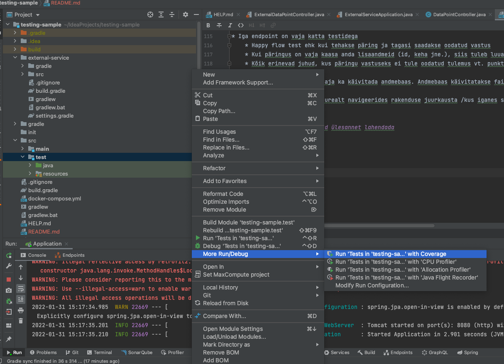

# Sissejuhatus

TestingSample on rakendus, mis on mõeldud võimaldama kasutajatel käidelda andmeid, mis pärinevad välisliidestusest.

# Andmemudel

Rakendus haldab andmeühikuid (data point). Igal andmepunktil on olemas järgmised väljad:

* id : 64 bit-ne täisarvuline identifikaator andmekirjest rakenduse andmebaasis
* externalId: 64 bit-ne täisarvuline identifikaator andmeallika andmebaasis
* value: sõne, mis hoiab andmepunkti väärtust
* comment: sõne, mida kasutatakse andmepunktiga seotud kommentaari hoidmiseks.
* significance: 32-bit-ne täisarv, mis kirjeldab andmepunkti statistilist tähtsust.

# REST API

## Veateated

Igal päringul võivad tulla erinevad tõrked ja nende tõrgete tagastamiseks on olemas kindlad vastused 

### Päringu sisendi viga

* HTTP staatus: 400
* Keha: 
```
{
   "id":"HTTP päringu identifikaator",
   "message":"Veateate põhjus",
   "errors":[
      {
         "field":"väli mis põhjustas viga",
         "reason":"vea põhjus (Validaatori nimi)",
         "message":"veateate sõnum"
      }
   ]
}
```
### Ressurssi ei leitud

* HTTP staatus: 404
* Keha: 
```
{
   "id":"HTTP päringu identifikaator",
   "message":"Entity {ressursi tüüp} not found",
   "entity":"{ressursi tüüp}",
   "criteria":[
      {
         "field":"kriteerium mille alusel ressurss otsiti",
         "value":"väärtus mille alusel ressurss otsiti"
      }
   ]
}
```

### Rakenduse viga

* HTTP staatus: 500
* Keha:
```
{
  "id": "HTTP päringu identifikaator",
  "message": "INTERNAL_SERVER_ERROR"
}
```

#Ülesanded, mida arendaja, kes rakenduse kirjutas, täitis

## Import

* Kasutaja saab algatada päringuga protsessi, mille käigus laetakse välisallikast alla andmepunktid ja salvestatakse andmebaasi. 
* Path: "/data-points/import" 
* Meetod: "POST"
* Näidus vastuse keha
```
[
  {
    "id": 1,
    "externalId": "external-id-1",
    "value": "49963689-038d-485b-8a57-a0ed9f9c81be",
    "comment": "comment8155ae01-f4ec-4f61-9f71-3f08f7b26838",
    "significance": 1
  },
  {
    "id": 2,
    "externalId": "external-id-2",
    "value": "5b9b5f17-021d-4ae7-931b-a1f74c763315",
    "comment": "comment5d04cf3f-b21d-4057-b2a1-641fccf4e95a",
    "significance": 0
  },
  {
    "id": 3,
    "externalId": "external-id-3",
    "value": "1bf0c37d-e69a-4247-94ad-e1c42fcadaf7",
    "comment": "comment619cc728-dc7c-4910-9363-809a9f7d864b",
    "significance": 1
  }
]
```


On vaja luua päring, millega saab andmeid sisse lugeda välisallikast.
Kui kasutaja teeb HTTP POST päringu URL-le “/data-points/import”, siis rakendus teeb omakorda päringu välisliidestusse, vastuseks saab JSON formaadis listi andmepunktidest (mis on sarnases formaadis nagu ta on andmemudelis) ja salvestab need kirjed maha andmebaasi.
Kui andmebaasis olev kirje ei sisaldu sensori andmete nimekirjas, siis need andmed ei kustu. Kui sensorist tulev kirje sisaldub juba andmebaasis, siis kirje sisu kirjutatakse andmebaasis üle.

Kui sensor ei vasta päringule siis tehtav päring peab andma tagasi veateate.


On vaja luua  päring, millega saab kätte nimekirja kõikidest andmetest andmebaasis.
Kui kasutaja teeb HTTP GET päringu URL-le “/data-points”, siis tagastatakse JSON kujul list andmepunktidest kus on kaasatud kõik andmed andmemudelist. Kui andmebaasis ei ole kirjeid, siis päring tagastab tühja list.

## Get by ID


On vaja luua päring, millega saab kätte konkreetse kirje konkreetse id alusel.
Kui kasutaja teeb HTTP GET päringu URL-le “/data-points/{id}”, kus {id} on soovitava andmepunkti identifikaator, siis päringu vastuses tagastatakse JSON formaadis andmeobjekt kõikide andmeväljadega, nagu need on andmebaasis.
Kui andmebaasis ei ole kirjeid sisendina antud id-ga, siis tagastakse HTTP veateade koodiga 404 ja vastava JSON formaadis veateatega.

## Get by external ID

On vaja luua päring, millega saab kätte konkreetse kirje konkreetse välisliidestuse (sensori) id alusel.
Kui kasutaja teeb HTTP GET päringu URL-le “/data-points/external-id/{externalId}”, kus {externalId} on soovitava andmepunkti identifikaator välisliidestuses, siis päringu vastuses tagastatakse JSON formaadis andmeobjekt kõikide andmeväljadega, nagu need on andmebaasis.
Kui andmebaasis ei ole sellise välisliidestuse id-ga kirjet, siis tagastatakse HTTP veateade koodiga 404 ja vastava JSON formaadis veateatega.


## Create

On vaja luua päring, millega saab kasutaja luua uue andmepunkti andmebaasi.
Kui kasutaja teeb HTTP POST päringu URL-le “/data-points” ja päringu kehas annab sisendiks JSON formaadis andmepunkti objekti, siis rakendus valideerib andmed nõuetekohaselt ja kui andmed vastavad nõuetele, siis salvestab kirje andmebaasi. Kui päring on edukas, siis antakse tagasi sama objekt mis anti sisendiks.
Kui andmed ei vasta nõuetele, siis tagastatakse HTTP veateade 400 ja vastuses kajastatakse mis läks valesti. Kui tehtakse päring kus externalId juba eksisteerib, siis kirjet ei kirjutata üle, vaid samuti antakse tagasi veateade.


## Update

On vaja luua päring, millega saab kasutaja redigeerida ühe andmepunkti andmeid andmebaasis.

Kui 

#Nõuded
* Iga endpoint on vaja katta testidega
    * Happy flow test ehk kui tehakse päring ja tagasi saadakse oodatud vastus
    * Kui päringus on vaja kaasa anda lisaandmeid (id, keha jne.), siis tuleb luua testid katmaks kõik nende andmete valideerimised ja erandjuhud (null väärtus, tühi väärtus jne.)
    * Kõik erinevad juhud, kus päringu vastuseks ei tule oodatud tulemus vt. punkti "Veateated", sel juhul peate testi nii üles ehitama, et happy flow ei saaks juhtuda
    * Ette on defineeritud klassid kaustas "src/test/java/ee/bitweb/testingsample/domain/datapoint/api".
    * Integratsioonitestid peaksid antud ülesande raames alati saatma päringu rakendusesse ja valideerima vastust.
    * Testide kirjutamiseks on vaja jälgida malli, selleks on ka korrektne test ette kirjutatud
    * Kuna testid käivitavad tühja rakenduse, siis testides neid meetodeid, kus on vaja andmebaasist andmeid küsida siis on need testi koodis vaja sinna lisada (defaultis on üks kirje baasis).
    * Igas testklassis on üks meetod ette defineeritud, selle testi peate valmis kirjutama ning edasi ise meetodeid looma
    * Meetodite nimed peavad kirjeldama seda, mida nad testivad nt "onValidIdShouldReturnSuccessResponse" tähendab seda, et teeme eelduse, et baasis on selle Id-ga kirje olemas ning testitakse seda, et selle ID järgi pärides tuleb tagasi valiidne vastus.
  
# Kirjeldus
* Integratsioonitestid käitavad päriselt rakenduse ja testid jooksutatakse käitatud rakenduse instances. 
  * Testide annotatsioonide ja konfiguratsioonide selgitus
    * Klassiannotatsioonid
      * "@AutoConfigureMockMvc" annotatsioon konfigureerib mockmvc tööriista, mida on vaja kasutada rakendusse päringute saatmiseks ja vastuse kontrollimiseks
      * "@SpringBootTest" annotatsiooni on vaja, et käitatakse päris Springi rakenduse instance, mida kasutatakse integratsioonitestimisel
    * Meetodi annotatsioonid
      * "@Test" annab meetodile teada, et tegu on testiga, ehk kõik testid peaks seda annotatsiooni kasutama
      * "@Transactional" ütleb meetodile, et kõik andmebaasi päringud jookseksid ühes transaktsioonis, kui meetod on oma töö lõpetanud (nt salvestatkse kirjed baasi), siis taastatakse selline baasiseis, milline see oli enne testi käitamist. Ehk kui test suhtleb baasiga peaks seda annotatsiooni kasutama.
      * "@Autowired" süstib testklassi vastava Springi beani. Seda on vaja kui tahate nt andmebaasi salvestad andmeid, mida testi lõppväljundis ootate.
      * "@BeforeAll", "@BeforeEach", "@AfterAll", "@AfterEach" on meetodiannotatsioonid, mis käivitavad vastavalt kas peale/enne igat/kõiki teste meetodi, mille peab ta on.
    * "MockMvc" beani (süstitud testklassi "@Autowired" annotatsiooniga) peaks kasutama iga test päringu rakendusele saatmiseks
    * "@MockBean" annotatsioon loob mock objekti ja seadistab selle spring rakenduse registris sedasi, et Spring kasutab seda rakenduse sees - kasulik ek lõikada osi rakendusest välja või süstida oma loogikat vahele. 

# NB LOE!!! 
Rakenduse käivitamiseks on vaja ka käivitada andmebaas. Andmebaas käivitatakse failist docker-compose.yml . Targemad IDE-d (intellij) panevad faili sisse käivitamise nupu (kaks rohelist noolekest faili sees)

Võimalik on ka käivitada käsurealt navigeerides rakenduse juurkausta /kus iganes see rakendus asub/testing-sample/ ja jooksutades seal käsku "docker-compose up -d"


#Nipid ja trikid, mis aitavad ülesannet lahendada
* Intellij võimaldab teste jooksutada koos koodikaetavusega ehk näete palju Teie koodist on testidega kaetud. See aga ei ole absoluutne tõde, sest kui testi käigus läbitakse koodi ilma et sealset sisu testitakse näitab coverage ikkagi, et see on kaetud. Kasulik on see aga selleks, et leida kohad, mis on täiesti katmata.
  


* Võimalik on kasutada sissehitatud kasutajaliidest, et käsitsi päringuid katsetada. Peale rakenduse käivitamist on võimalik kasutajaliidessesse brauseris navigeerida aadressil: http://localhost:8080/swagger-ui/index.html
    


